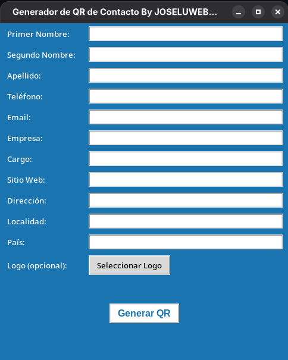

# Generardor QR vCard

* Objetivo
* Configuración / Instalación
* Editor/Lenguaje
* Conclusión

---
## Objetivo
El objetivo de este respositorio es subir mis prácticas, en este caso utilizando cómo lenguaje de programación **Python**.
Después de investigar e ir comparando código, fuí desarrollando de a poco esta app. La misma es con fines educativos, no soy responsable por el uso que se le de a la misma.

En este caso hice un Generador de QR con información de contacto listo para agendar en el celular, permite adjuntar el logo para que salga en el centro del QR

## Configuración / Instalación

1. Clonar este repositorio.
2. Crear un entorno virtual y activarlo
   ~~~
   $ python3 -m venv .env
   $ source .env/bin/activate
   ~~~
3. Chequear que pip esté instalado, en caso de que no lo esté instalar pip
   ~~~
   $ pip --version
   

   $ python -m ensurepip --upgrade
   ~~~
4. Instalar las dependencias usando el archivo requirements:
    ~~~
    $ pip install -r requirements
    ~~~
5. Una vez que tenemos todo instalado hay que ejecutar generar_vCard.py
   ~~~
    $ python3 generar_vCard.py
    ~~~

## Editor/Lenguaje:

## Conclusión
